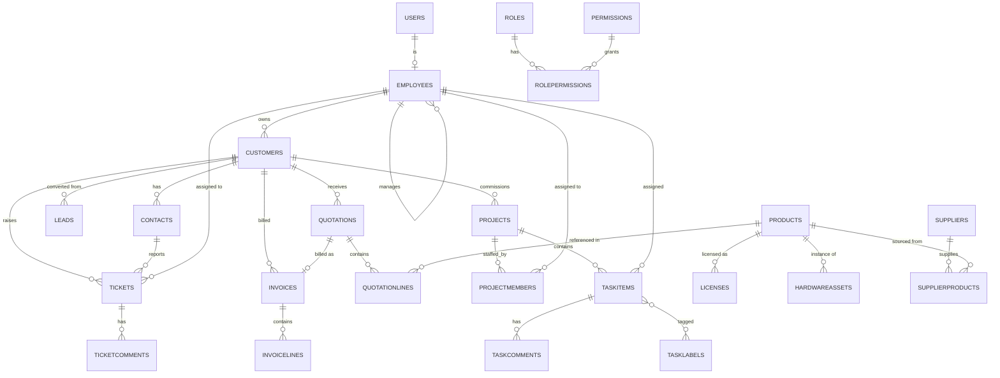

# RTS ERP — Database Schema & ERD

SQL Server, accessed via EF Core Code-First. All tables include the common audit columns from `BaseEntity` unless noted: `Id (uniqueidentifier, PK)`, `CreatedAt`, `CreatedBy`, `ModifiedAt`, `ModifiedBy`, `IsDeleted` (soft delete).

## 1. Identity & User Management

**Users** *(ASP.NET Identity `AspNetUsers` extended)*
| Column | Type | Notes |
|---|---|---|
| Id | uniqueidentifier | PK |
| Email | nvarchar(256) | unique |
| PasswordHash | nvarchar(max) | |
| FirstName | nvarchar(100) | |
| LastName | nvarchar(100) | |
| AvatarUrl | nvarchar(500) | nullable |
| IsActive | bit | |
| EmployeeId | uniqueidentifier | FK → Employees, nullable |

**Roles** *(`AspNetRoles` extended)* — Id, Name (Admin, Manager, Employee, SupportAgent, ReadOnly)

**Permissions** — Id, Code (`crm.customers.write`), Description, Module

**RolePermissions** — RoleId (FK), PermissionId (FK) — composite PK

**Employees**
| Column | Type | Notes |
|---|---|---|
| Id | uniqueidentifier | PK |
| UserId | uniqueidentifier | FK → Users, nullable (not every employee has login) |
| FullName | nvarchar(200) | |
| JobTitle | nvarchar(150) | |
| Department | nvarchar(100) | |
| HireDate | date | |
| ManagerId | uniqueidentifier | FK → Employees, nullable (self-referencing) |

## 2. CRM

**Customers**
| Column | Type | Notes |
|---|---|---|
| Id | uniqueidentifier | PK |
| CompanyName | nvarchar(200) | |
| Industry | nvarchar(100) | |
| Website | nvarchar(200) | nullable |
| Phone | nvarchar(50) | |
| BillingAddress | nvarchar(500) | |
| AccountOwnerId | uniqueidentifier | FK → Employees |

**Contacts**
| Column | Type | Notes |
|---|---|---|
| Id | uniqueidentifier | PK |
| CustomerId | uniqueidentifier | FK → Customers |
| FullName | nvarchar(200) | |
| Email | nvarchar(256) | |
| Phone | nvarchar(50) | |
| JobTitle | nvarchar(150) | |
| IsPrimary | bit | |

**Leads**
| Column | Type | Notes |
|---|---|---|
| Id | uniqueidentifier | PK |
| CompanyName | nvarchar(200) | |
| ContactName | nvarchar(200) | |
| Email | nvarchar(256) | |
| Source | nvarchar(100) | web, referral, event... |
| Status | int | enum: New, Contacted, Qualified, Converted, Lost |
| EstimatedValue | decimal(18,2) | |
| OwnerId | uniqueidentifier | FK → Employees |
| ConvertedCustomerId | uniqueidentifier | FK → Customers, nullable |

## 3. Quotations

**Quotations**
| Column | Type | Notes |
|---|---|---|
| Id | uniqueidentifier | PK |
| QuoteNumber | nvarchar(50) | unique, generated |
| CustomerId | uniqueidentifier | FK → Customers |
| Status | int | enum: Draft, Sent, Accepted, Rejected, Expired |
| IssueDate | date | |
| ExpiryDate | date | |
| Subtotal | decimal(18,2) | |
| TaxAmount | decimal(18,2) | |
| Total | decimal(18,2) | |
| OwnerId | uniqueidentifier | FK → Employees |

**QuotationLines**
| Column | Type | Notes |
|---|---|---|
| Id | uniqueidentifier | PK |
| QuotationId | uniqueidentifier | FK → Quotations |
| ProductId | uniqueidentifier | FK → Products, nullable |
| Description | nvarchar(500) | |
| Quantity | decimal(18,2) | |
| UnitPrice | decimal(18,2) | |
| LineTotal | decimal(18,2) | |

## 4. Projects & Tasks

**Projects**
| Column | Type | Notes |
|---|---|---|
| Id | uniqueidentifier | PK |
| Name | nvarchar(200) | |
| CustomerId | uniqueidentifier | FK → Customers, nullable |
| Status | int | enum: Planning, Active, OnHold, Completed, Cancelled |
| StartDate | date | |
| EndDate | date | nullable |
| Budget | decimal(18,2) | nullable |
| ProgressPercent | int | 0–100 |
| ProjectManagerId | uniqueidentifier | FK → Employees |

**ProjectMembers** — ProjectId (FK), EmployeeId (FK), RoleOnProject (nvarchar) — composite PK

**TaskItems**
| Column | Type | Notes |
|---|---|---|
| Id | uniqueidentifier | PK |
| ProjectId | uniqueidentifier | FK → Projects, nullable |
| Title | nvarchar(300) | |
| Description | nvarchar(max) | nullable |
| Status | int | enum: Todo, InProgress, InReview, Done |
| Priority | int | enum: Low, Medium, High, Urgent |
| AssigneeId | uniqueidentifier | FK → Employees, nullable |
| DueDate | date | nullable |
| Position | int | for kanban ordering within a column |

**TaskComments** — Id, TaskItemId (FK), AuthorId (FK → Employees), Content, CreatedAt

**TaskLabels** — Id, Name, Color; **TaskItemLabels** (many-to-many: TaskItemId, LabelId)

## 5. Help Desk

**Tickets**
| Column | Type | Notes |
|---|---|---|
| Id | uniqueidentifier | PK |
| TicketNumber | nvarchar(50) | unique |
| Subject | nvarchar(300) | |
| Description | nvarchar(max) | |
| CustomerId | uniqueidentifier | FK → Customers, nullable |
| Status | int | enum: Open, InProgress, Waiting, Resolved, Closed |
| Priority | int | enum: Low, Medium, High, Critical |
| AssignedToId | uniqueidentifier | FK → Employees, nullable |
| CreatedByContactId | uniqueidentifier | FK → Contacts, nullable |

**TicketComments** — Id, TicketId (FK), AuthorId, Content, IsInternalNote (bit), CreatedAt

## 6. Inventory

**Products** — Id, Sku, Name, Category (enum: Software, Hardware, License, Service), UnitPrice, Description

**Licenses** — Id, ProductId (FK), CustomerId (FK, nullable), LicenseKey, SeatsTotal, SeatsUsed, ExpiryDate

**HardwareAssets** — Id, ProductId (FK), SerialNumber, CustomerId (FK, nullable), AssignedEmployeeId (FK, nullable), PurchaseDate, WarrantyExpiry, Status (enum: InStock, Assigned, Retired)

**Suppliers** — Id, Name, ContactEmail, Phone, Address

**SupplierProducts** — SupplierId (FK), ProductId (FK), SupplierSku, CostPrice — composite PK

## 7. Invoicing

**Invoices**
| Column | Type | Notes |
|---|---|---|
| Id | uniqueidentifier | PK |
| InvoiceNumber | nvarchar(50) | unique |
| CustomerId | uniqueidentifier | FK → Customers |
| QuotationId | uniqueidentifier | FK → Quotations, nullable |
| IssueDate | date | |
| DueDate | date | |
| Status | int | enum: Draft, Sent, PartiallyPaid, Paid, Overdue, Cancelled |
| Subtotal | decimal(18,2) | |
| TaxAmount | decimal(18,2) | |
| Total | decimal(18,2) | |
| AmountPaid | decimal(18,2) | |

**InvoiceLines** — Id, InvoiceId (FK), Description, Quantity, UnitPrice, LineTotal

## 8. Settings

**CompanySettings** — Id (singleton row), CompanyName, LogoUrl, Address, TaxId, DefaultCurrency, FiscalYearStart

## Entity Relationship Diagram

## Indexing notes
- Unique indexes on `Customers.CompanyName`, `Quotations.QuoteNumber`, `Invoices.InvoiceNumber`, `Tickets.TicketNumber`, `Users.Email`.
- Non-clustered indexes on FK columns used in list-page filters: `TaskItems.ProjectId`, `TaskItems.AssigneeId`, `Tickets.Status`, `Invoices.Status`.
- `IsDeleted` included in a filtered index alongside status columns used for default list views (soft-delete filter is applied globally via EF Core query filter).
