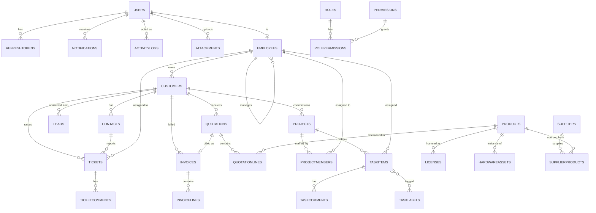

# RTS ERP — Database Schema (Final) & ERD

Supersedes Database.md. Adds `RefreshTokens`, `Notifications`, `ActivityLogs`, `Attachments`, and a `Permissions` seed list, per the approved Step 1/Step 2 fixes. All other tables are unchanged from Database.md and are not repeated in full here except where a constraint changed — see §9 for the delta summary.

SQL Server, EF Core Code-First. Common audit columns from `BaseEntity` (`Id uniqueidentifier PK`, `CreatedAt`, `CreatedBy`, `ModifiedAt`, `ModifiedBy`, `IsDeleted`) apply to every table below unless noted.

## 1. New: Identity & Session

**RefreshTokens**
| Column | Type | Constraint |
|---|---|---|
| Id | uniqueidentifier | PK |
| UserId | uniqueidentifier | FK → Users, NOT NULL |
| TokenHash | nvarchar(500) | NOT NULL — token is hashed at rest, never stored plain |
| ExpiresAt | datetime2 | NOT NULL |
| CreatedByIp | nvarchar(45) | nullable |
| RevokedAt | datetime2 | nullable |
| ReplacedByTokenId | uniqueidentifier | FK → RefreshTokens, nullable (self-referencing, rotation chain) |

Constraint: non-clustered index on `(UserId, RevokedAt)` for the "log out of all devices" query and login-time active-session lookups. No `IsDeleted` — tokens are never soft-deleted, only revoked; revocation is the domain-meaningful state.

## 2. New: Notifications

**Notifications**
| Column | Type | Constraint |
|---|---|---|
| Id | uniqueidentifier | PK |
| UserId | uniqueidentifier | FK → Users, NOT NULL |
| Type | nvarchar(100) | NOT NULL — e.g. `ticket.assigned`, `quotation.accepted` |
| Title | nvarchar(200) | NOT NULL |
| Message | nvarchar(500) | NOT NULL |
| LinkUrl | nvarchar(500) | nullable — deep link into the relevant screen |
| IsRead | bit | NOT NULL, default 0 |
| ReadAt | datetime2 | nullable |

Constraint: non-clustered index on `(UserId, IsRead, CreatedAt DESC)` — this is the exact shape of the drawer's query (unread-first, newest-first, scoped to the current user).

## 3. New: Activity Log

**ActivityLogs**
| Column | Type | Constraint |
|---|---|---|
| Id | uniqueidentifier | PK |
| EntityType | nvarchar(100) | NOT NULL — e.g. `Customer`, `Quotation` |
| EntityId | uniqueidentifier | NOT NULL |
| Action | nvarchar(50) | NOT NULL — `Created`, `Updated`, `StatusChanged`, `Deleted` |
| Description | nvarchar(500) | NOT NULL — human-readable, generated at write time (e.g. "Quotation Q-2026-014 marked Accepted") |
| ActorId | uniqueidentifier | FK → Users, NOT NULL |

Constraint: non-clustered index on `(EntityType, EntityId, CreatedAt DESC)` for entity-scoped feeds (Customer Detail's Activity tab), and a second on `CreatedAt DESC` alone for the Dashboard's global feed. No `ModifiedAt`/`IsDeleted` — activity log rows are append-only and immutable by design.

## 4. New: Attachments

**Attachments**
| Column | Type | Constraint |
|---|---|---|
| Id | uniqueidentifier | PK |
| EntityType | nvarchar(100) | NOT NULL — `Ticket`, `Project`, `Company` (for logo) |
| EntityId | uniqueidentifier | nullable — null for singleton attachments like the company logo |
| FileName | nvarchar(300) | NOT NULL |
| FileUrl | nvarchar(500) | NOT NULL |
| ContentType | nvarchar(100) | NOT NULL |
| SizeBytes | bigint | NOT NULL, CHECK (SizeBytes <= 10485760) — 10MB cap enforced at the DB and API layer |
| UploadedById | uniqueidentifier | FK → Users, NOT NULL |

Constraint: non-clustered index on `(EntityType, EntityId)`.

**Users.AvatarUrl** stays a direct column (not an Attachment row) — it's a single, always-present value looked up on every request via the JWT claim, not worth a join; the Attachments table is for the cases where an entity can have zero-to-many files.

## 5. New: Permissions Seed List

One row per module × action. Seeded by `DbSeeder`, not user-editable (Roles reference these, Permissions themselves are fixed):

```
crm.customers.read / .write / .delete
crm.contacts.read / .write / .delete
crm.leads.read / .write / .delete / .convert
quotations.read / .write / .delete / .send / .approve
projects.read / .write / .delete / .manage-members
tasks.read / .write / .delete / .assign
helpdesk.read / .write / .delete / .assign
inventory.products.read / .write / .delete
inventory.licenses.read / .write / .delete
inventory.hardware.read / .write / .delete
inventory.suppliers.read / .write / .delete
invoices.read / .write / .delete / .record-payment
reports.view
users.read / .write / .manage-roles
settings.read / .write
```

`Admin` role gets all permissions at seed time; `ReadOnly` gets every `.read` and `reports.view`; `Manager`/`Employee`/`SupportAgent` get scoped subsets reflecting their day-to-day module usage (defined at seed time, editable afterward via the Roles & Permissions screen).

## 6. Constraint additions to existing tables

- `Quotations.Status` transition is enforced at the Application layer (state machine in the command handlers), not a DB CHECK constraint — status transition rules (e.g., can't go from `Rejected` back to `Sent`) are business logic, not data integrity, and belong in code where they're testable and can return a meaningful validation error rather than a raw SQL constraint violation.
- `Invoices.AmountPaid` gets a CHECK constraint: `AmountPaid <= Total` — this one **is** a data-integrity rule (never valid regardless of business workflow), so it belongs at the DB level as a last line of defense even though the Application layer also validates it.
- `Licenses.SeatsUsed` gets a CHECK constraint: `SeatsUsed <= SeatsTotal`, same reasoning.

## 7. Normalization Review

Schema is in 3NF throughout:

- No repeating groups (line items are separate tables — `QuotationLines`, `InvoiceLines` — not comma-separated columns).
- No partial dependencies on composite keys (`RolePermissions`, `ProjectMembers`, `SupplierProducts`, `TaskItemLabels` are all pure junction tables with no non-key attributes hanging off part of the composite key).
- No transitive dependencies — e.g., `Quotations` doesn't store `CustomerName`/`CustomerAddress` redundantly; it stores `CustomerId` and joins.

**One deliberate denormalization**: `QuotationLines.Description` and `LineTotal`, `InvoiceLines.Description` and `LineTotal` are stored even though they're derivable from `Product` + `Quantity` × `UnitPrice` at query time. This is intentional, not an oversight — a quotation must remain a snapshot of what was quoted even if the underlying Product's price or description changes later. Same reasoning applies to `UnitPrice` on both line tables.

## 8. Full ERD (updated)



`ActivityLogs` and `Attachments` are polymorphic (`EntityType` + `EntityId`) rather than FK'd to every possible parent table — deliberately not modeled as a strict ERD relationship, since a real FK per entity type would mean a nullable FK column to every single module's table, which is worse than a documented polymorphic pattern for a table whose only job is "list recent things that happened to X."

## 9. Delta summary vs. Database.md

- Added: `RefreshTokens`, `Notifications`, `ActivityLogs`, `Attachments`.
- Added: `Invoices.AmountPaid <= Total` and `Licenses.SeatsUsed <= SeatsTotal` CHECK constraints.
- Added: Permissions seed list (§5) — previously the table existed with no defined rows.
- No changes to any other existing table, column, or relationship — everything else in Database.md stands as approved.

---

**Waiting for your approval to proceed to Step 4**: API review + final endpoints/DTOs/validation/authentication/authorization/response models, updated for `Notifications`, `Search`, and refresh-token/auth changes from this step.
